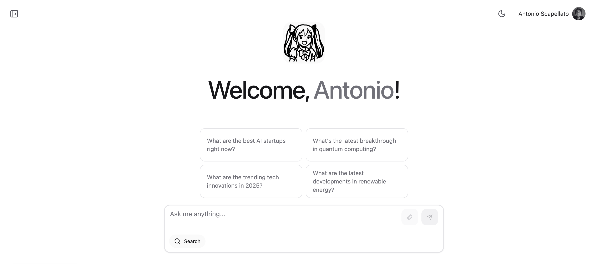

# MikuOS - Opensource Personal AI Agent

MikuOS is an open-source AI assistant that aims to revolutionize how we interact with artificial intelligence. Currently serving as a powerful alternative to ChatGPT and Perplexity, MikuOS is on its way to becoming the first truly personal AI agent.



## 🌟 Features

- **Advanced Language Understanding**: Powered by state-of-the-art language models
- **Open Source**: Transparent, community-driven development
- **Privacy-Focused**: Your data stays with you
- **Customizable**: Adapt to your specific needs and preferences
- **Extensible**: Easy to integrate with other tools and services

## Current Capabilities

- Natural language conversations
- Information retrieval and summarization
- Code assistance and debugging
- Creative writing and content generation
- Knowledge-based question answering

## Future Vision

MikuOS is evolving into a comprehensive AI personal agent that will:
- Learn and adapt to your personal preferences
- Automate routine tasks
- Provide proactive assistance
- Integrate seamlessly with your digital life
- Maintain context across conversations and tasks

## Getting Started

To run MikuOS locally:

1. **Clone the repository**

2. **Install dependencies**:
   ```bash
   npm install
   ```

3. **Set up environment variables**:
   - Create a `.env.local` file in the root directory
   - Add your required configuration/data to `.env.local`

4. **Start the development server**:
   ```bash
   npm run dev
   ```
5. Open [http://localhost:3000](http://localhost:3000) in your browser to use MikuOS.

## 🛠️ Tech Stack

### Core Framework
- **Next.js** - React framework for production
- **Tailwind CSS** - Utility-first CSS framework

### AI & Language Models
- **Together AI** - AI model integration
- **Tavily** - Web search capabilities

### Authentication & Database
- **Supabase** - Authentication and database services

### UI Components & Styling
- **HeroUI** - Component library
- **Framer Motion** - Animation library
- **React Icons** - Icon library
- **React Markdown** - Markdown rendering
- **React Force Graph** - Graph visualization

## 🤝 Contributing

We welcome contributions from the community! Whether you're a developer, designer, or AI enthusiast, there are many ways to get involved.

[Contribution guidelines coming soon]

## License

MikuOS is licensed under the Business Source License 1.1 (BSL 1.1). This means:
- **Non-commercial use is permitted**: You can use, modify, and distribute MikuOS for non-commercial purposes.
- **Commercial use requires a separate license**: For any commercial or production use, please contact the Licensor for a commercial license.

See the [LICENSE](./LICENSE) file for full details.

## 🌐 Community

- [Reddit](https://www.reddit.com/r/mikuos/)
- [Linkedin](https://www.linkedin.com/company/miku-os/)

---

*MikuOS is under active development. Stay tuned for updates and new features!*


